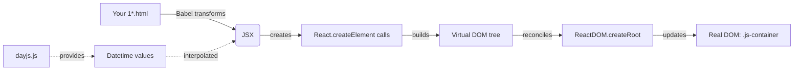

# React Basics: From Zero to DOM 💥

> **A bite-sized, hands-on journey through React fundamentals — render JSX, inject expressions, and build live UI updates. No build step, no setup friction, just pure React magic in your browser.**

  

---

## 🚀 Why This Exercise?

Ever stared at a React tutorial that demands `npx create-react-app`, three terminal windows, and 20 minutes of waiting before you see *anything* on screen?

**We did that wrong, too.** That's why we built this.

`React-Exercise` strips React down to its absolute essentials and delivers **10 progressive, copy-paste-ready HTML lessons** that go from "what is a React component" to **live-updating clock UIs** — in under 15 minutes. No Node.js. No npm. No webpack config. Just open an HTML file, fire up a local server, and watch React render.

![React Learning Flow](https://mermaid.ink/img/pzE1J9l0aXRlOiAnZ2F0ZSc7CmM3bnFwYjJxMzhjWyJObyBuZXQsIG5vIG5wbSwgbm8gd2VicGFjayJdCnY5c2ZjM2M0YzhbIlJlYWN0IC0gTm8gYnVpbGQgc3RlcCJdCjZ2YXZxYjN5cTRbIkpTWCAtIE5hdGl2ZSBteXN0aWNrIG1hZ2ljIl0KZG1jY2E4ODFqY1siVXNlcyBicm93c2VyIEphdmFTY3JpcHQgZXhhY3RseSBhcyB5b3UgZXhwZWN0Il0KdXUxcXQ4bjFkNlYiU2V0dXAgZ29lcyBmcm9tIDIwaG91cnMgdG8gMjAgbWludXRlcyJdCnQ3M3Q3ZmVlYmN6WyJNYWtlcyBJbnRlcmFjdGl2ZSBJVVMgaW4gbWludXRlcywgbm90IGRheXMiXQpoOGI1cWt2bW14WyJSZWFjdCB3aXRob3V0IHNldHVwIGZhY2lhZGUiXQouJywgZXh0ZXJuYWw6IHsKICAnZG1jY2E4ODFqYyc6IHsKICAgICdwYXRoJzogJ2h0dHBzOi8vZG9jcy5yZWFjdGl2YS5pby9pbWcvcmVhY3Qtd2hpdGUtb24tYmxhY2sub3JnJywKICAgICd3aWR0aCc6IDEzMCwKICAgICdoZWlnaHQnOiAxMzAsCiAgICAnc3R5bGUnOiAnZGlzcGxheTogYmxvY2s7JywKICAgICd0b29sdGlwJzogJ1JlYWN0JywKICAgICdncm91cCc6IHsKICAgICAgJ3Zpc2liaWxpdHknOiAnaGlkZGVuJwogICAgfQogIH0KfQp8IGY9Pz09PiB8IHw9PT09PiB8IHw9PT09PiB8IHw9PT09PiB8IHw9PT09PiB8Cm41cDZuYmMzNGR2WyJObyBzZXR1cCwgZnVsbCBjb250cm9sIl0KbnI5ZGI2OW56aXMrIi5oIGxlc3NvbnMgcGFja2VkIGluIG9uZSBnaXQgcmVwbyJ9CgplNWFuY2EzajQwYVsiT3Blbi4gU2VydmUuIFJlYWRhci5SZWFjdC4iXQplcDRkY2RmZ2M5WyJNYWtlIHRoaW5ncyBtb3ZlLiBMaWtlIHJlYWwuIl0KbWc1NnE4Y3RkM1siTGVhcm4gYnkgY29weS1wYXN0ZS1hbmQtZXhlY3V0ZSIsCidzdHlsZSc6ICdwb2x5Z29uJywKICBzdGFydDogJ2ZmZmZmZicsCiAgc3Ryb2tlOiAnIzIyMycKfQo7OykgLS0gPiB8N3QzNm5iYzNkY3ZbIlJlYWN0IEZ1bmRhbWVudGFscyJdCiAgICB8LS0gPiB8ODRrYmM5ZGZkNlYiSXMgZmFzdC4gSXQncyBmb3IgcGVvcGxlIHdobyB3YW50IHRvIGxlYXJuIFJlYWN0IGJlZm9yZSB0aGV5IGJ1aWxkLiBfSXQncyBmb3IgbWFrZXJzLCBkZXZhb3AsIGFuZCBhbnlvbmUgd2hvJ3MgZmVhcmVkIGJ5IHNldHVwIGZhY2lhZGUuXQo7OykgLS0gPiB8N3QzNm5iYzNkY3ZbIlJlYWN0IEZ1bmRhbWVudGFscyJdCiAgICB8LS0gPiB8ODRrYmM5ZGZkNlYiSXMgZmFzdC4gSXQncyBmb3IgcGVvcGxlIHdobyB3YW50IHRvIGxlYXJuIFJlYWN0IGJlZm9yZSB0aGV5IGJ1aWxkLiBfSXQncyBmb3IgbWFrZXJzLCBkZXZhb3AsIGFuZCBhbnlvbmUgd2hvJ3MgZmVhcmVkIGJ5IHNldHVwIGZhY2lhZGUuXQ==)

---

## 🎯 What You'll Learn

| Lesson | Concept | Real-World Use |
|--------|---------|----------------|
| `1a.html` | Basic DOM rendering | Loading any UI into a page |
| `1b.html` | JSX elements (`<p>`, `<div>`) | Writing React markup |
| `1c.html` | Nested/multiple elements | Product cards, lists |
| `1d.html` | Expressions + console.log | Debugging React values |
| `1e.html` | Template literals in JSX | Dynamic user profiles |
| `1f.html` | Calculated values in UI | Shopping carts, totals |
| `1g.html` | Day.js library integration | Working with dates |
| `1h.html` | Dynamic text interpolation | Date/time displays |
| `1I.html` | **Live `setInterval` updates** | Live clocks, dashboards, tickers |

By the end, you'll be able to render static markup, interpolate dynamic values, and build **live-updating interfaces** — the core skill every React developer uses daily.

---

## 🧩 How It Works

```
┌─────────────────────────────────────────────────────────────────┐
│  1. Open any 1*.html file in your browser (VS Code + Live Server)│
├─────────────────────────────────────────────────────────────────┤
│  2. Babel in-browser transpiles your JSX → React.createElement  │
├─────────────────────────────────────────────────────────────────┤
│  3. ReactDOM.createRoot() mounts your component tree            │
├─────────────────────────────────────────────────────────────────┤
│  4. React diffing keeps the DOM in sync (watch the clock tick!) │
└─────────────────────────────────────────────────────────────────┘
```

### Dependency-Free Architecture



### Why This Beats Other React Tutorials

- ⚡ **Instant gratification** — See React work in minutes, not hours.
- 🔧 **Zero environment hell** — No `node_modules`, no port conflicts, no "port already in use."
- 🧠 **Focus on concepts, not config** — Every lesson isolates one React idea so nothing gets lost in build-tool noise.
- 🎁 **Copy-paste-and-learn** — Run each lesson as-is, then tweak a line to see what breaks (the best kind of learning).
- 🌐 **Works offline** — CDN-hosted, so you can learn anywhere.

---

## 🛠 Installation

This project runs without installation. Here's how to get started:

```bash
# 1. Clone the repo
git clone https://github.com/yourusername/react-exercise.git
cd react-exercise

# 2. Open lesson-01/1a.html in your browser
# Recommended: install the "Live Server" extension in VS Code
# then right-click any .html file → "Open with Live Server"
```

That's it. Every lesson pulls React, React-DOM, and Babel from unpkg.com — no `npm install` needed.

### Requirements

- Any modern browser (Chrome, Firefox, Edge, Safari)
- A code editor (VS Code recommended)
- (Optional) Live Server or another static file server

---

## ▶️ Usage

Run any lesson by opening it in a browser:

```
Open lesson-01/1a.html → See your first rendered React element
Open lesson-01/1I.html → Watch a live-updating clock (setInterval)
```

Try it yourself: in `1I.html`, change `1000` to `100` in `setInterval` and watch the clock sprint. That's the power of editing live.

---

## 🤝 Contribution

Contributions are what make this exercise better for everyone. Here's how to get involved:

1. **Fork** the repo
2. **Create your branch** — `git checkout -b feat/add-lesson-11-components`
3. **Make your changes** — follow the same pattern as existing lessons
4. **Open a Pull Request**

We welcome:

- New lessons for advanced topics (props, state, useEffect, hooks)
- Clarified comments or explanations in existing lessons
- Better browser-compatibility notes

> **Note:** Please keep lessons standalone and beginner-friendly — the spirit of this repo is "open, run, learn."

---

## 📄 License

MIT — feel free to use, modify, and share.

---

**Built with ❤️ for the next generation of React developers.**

*Clone it. Run it. Break it. Build something real.*
